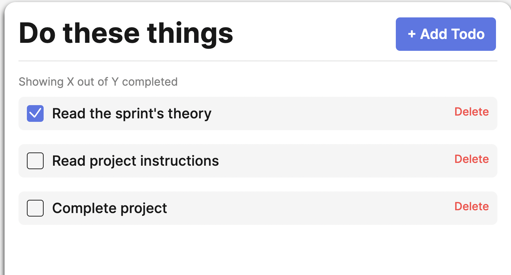
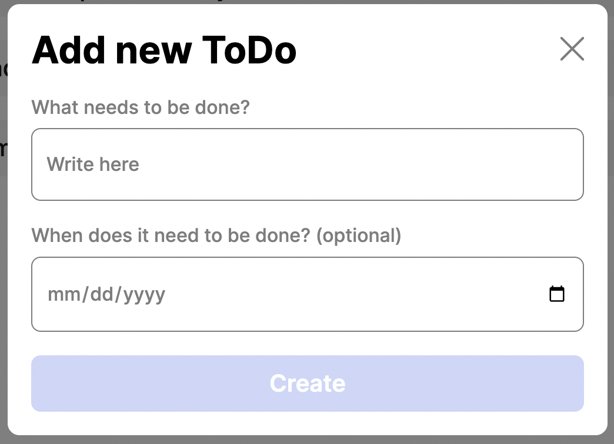
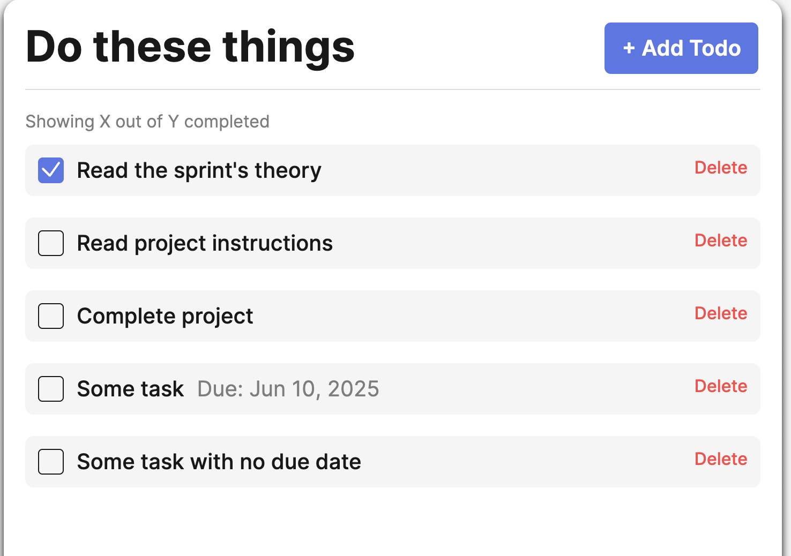

# Simple Todo App

A simple web app to create a list of things to do.

## Functionality

The app allows the user to create cards with a reminder and the option to set a due date. Due date is optional and can be left blank. The user also has the ability to delete todo cards. The popup modal has validation to require more than one character and to narrow a date to a specific date range.

## Screen Shots

## Technology

This project refactored the original javascript to use object classes.

## Deployment

This project is deployed on GitHub Pages:

- ADD LINK HERE
